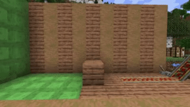
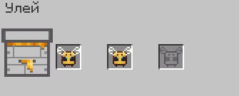
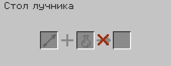
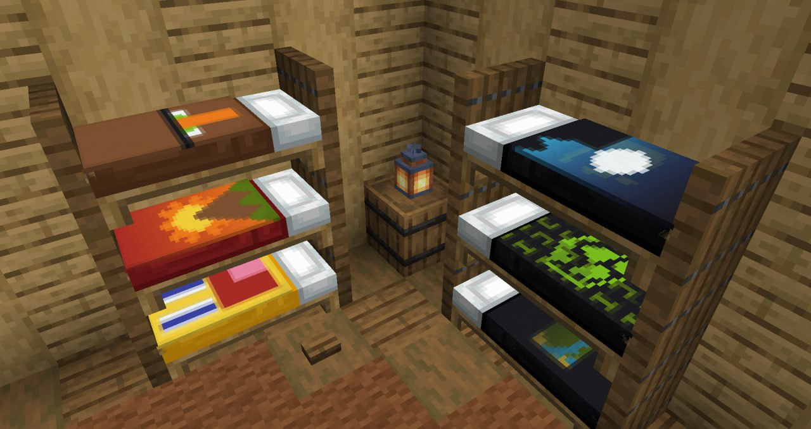

# Мелкие механики

## Физика вагонеток

Мы прокачали физику вагонеток. Теперь они способны отпрыгивать от блоков слизи, а также способны подлетать вверх при движении вверх на обрыве.

## Некопируемые карты 

Вам хочется сделать ваш рисунок на карте уникальным в своём роде? Решение есть - сделайте его некопируемым! 

Сделать это очень просто - надо всего лишь обложить карту красными стеклянными панелями в верстаке.

## Просмотр содержимого пасеки

Хотите посмотреть, сколько пчёл находится в пасеке? Просто нажмите ПКМ во время приседа и наслаждайтесь! Только не перепутайте пасеку с ульем!

## Стол лучника

Мы добавили функционал столу лучника. Теперь он способен накладывать эффекты на обычные стрелы. Интерфейс интуитивно понятен, так что не имеет смысла объяснять. 

## Декорация кроватей

На нашем сервере доступна кастомизация кроватей - вы можете поверх кровати, как некое одеяло, надеть любой баннер. 

Делается это нажатием ПКМ во время приседа.

## Вес брони

Всё просто - у каждой брони есть свой вес, который будет замедлять вашу скорость передвижения. Вы также будете замедляться при держании щита, наковальни и других "тяжелых" блоков в руке.

## Прокачивание лошадей

***Расписать***

## Переработка жителей 

Не смотря на действия Mojang в снапшотах к 1.20.2 / 1.21, мы решили по-своему переработать торговлю с жителями. У всех жителей изменены таблицы торгов, из-за чего вам будет интереснее с ними торговать. 

Таблицы торгов жителей были во многом перебалансированы и в них были введены новые предметы на сервере.

## Улучшенный странствующий торговец

Торговля с странствующими торговцами на нашем сервере была также переработана. Теперь они помимо скучных и зачастую ненужных обычных предметов продают достаточно интересные, а главное эксклюзивные предметы, такие как **различные декоративные головы, зачарованные инструменты** (с кастомными чарами), да и просто ценные вещи.

Все новые торги продаются в алмазах, цена начинается с 4 единиц.

Кроме вышесказанного, торговцы продают **пилу**, которая стоит 32 алмаза. Пила позволяет, разрушая обычные блоки, получать их в виде декоративной головы. Этот эффект распространяется только на полноценные твердые блоки.

## Нерабочие фермы

Да, у нас не работают некоторые фермы, а точнее самые имбовые среди них: фермы тотемов и шалкеров. 

Если вы попытаетесь их сделать, то у вас ничего не получится и вы просто потратите своё время на это.